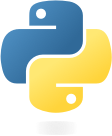
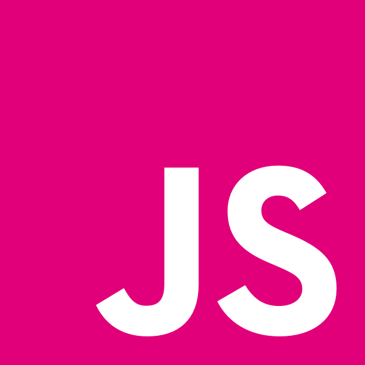

# Boot Camp 

__*CAUTION: UNDER CONSTRUCTION!*__
__*Check the [roadmap](#roadmap) to get synced with the progress*__

[简体中文](https://translate.google.com)

## Summary 

Welcome my friend! 

Since you got here, I believe you've already gone through the new employee entry procedure. And for those haven't, or even not being one of the
[zaoshu](https://zaoshu.io) family (yet), you're welcomed too! We'd love to show you our engineering culture, work flow and coding style.

## Engineering 

### Agile Development

We use scrum in daily development for software life cycle management...

### [Git ](./engineering/git.md) 

Codebase version control matters when we need to cooperate with multiple coders in a complex. We use Git(Hub) to do that and we wanna do better. 

### Code Review

### Workflow

### Teamwork

## Tech-stack

### Language

- [ Go](./tech_stack/go/index.md)
-  Python
-  JavaScript

## DevOps

- [Docker](./tech_stack/devops/docker.md)

### Storage\FileSystem

### Microservice

## Toolkit

Our daily productivity apps & tools. 

- [General](./toolkit/general.md)
- [MacOS](./toolkit/macos.md)

## Roadmap

- [x] bootcamp documentation index
- [ ] engineering
    - [ ] agile
    - [x] git
    - [ ] code review 
    - [ ] workflow
    - [ ] teamwork
        - [ ] face2face
        - [ ] slack
        - [ ] email 
- [ ] tech-stack
    - [ ] language
        - [x] go
        - [ ] python
    - [ ] storage\filesystem
        - [ ] postgresql
        - [ ] redis
        - [ ] hbase
    - [ ] microservice
- [ ] toolkit 
    - [x] macos

