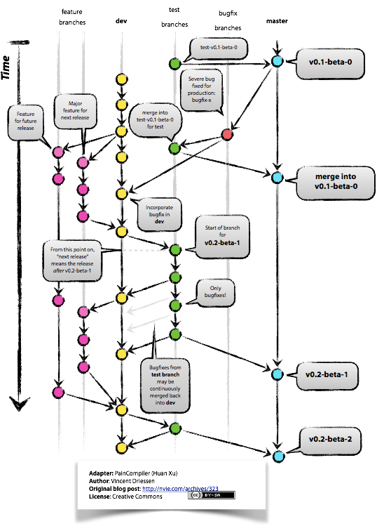

# Workflow

- [Git Workflow](#git-workflow)

## Git Workflow

The zen of Git workflow is all about [`branching`](./git.md#learn-git-branching), whose models differ among teams.

We basicly follow a classic `DRM-FH(develop;release;master-feature;hotfix)` model with some slightly differences(due to some tech debt):

### Branching model:

*Original chart by: [Vincent Driessen](http://nvie.com/about/)*

Main branches:

- `dev`:
    - the most active workspace moving fast
    - where all features\\~~bugs~~\builds begin

- `master`:
    - the production-ready branch represents stable state
    - no direct push allowe and donly accept pull requests from `test-*` branch 

Supporting branches:

- `feature-${feature-name}`:
    - where new feature development begins
    - start from `dev` then merge back to it

- `test-${version}`:
    - created since the current version on `dev` is ready to take off for pre-release and the sprint of new version begin
    - where all `bugfix-*` began

- `bugfix-${bug-name}`:
    - always off from `test-*` or `master` 
    - always merge back to `dev`

### Principles

- Always communicate with your co-workers before do remote rebase\merge
- I'm working on the point 2 don't worry

### Recommended Reading

- [A successful Git branching model](http://nvie.com/posts/a-successful-git-branching-model/) by Vincent Driessen 